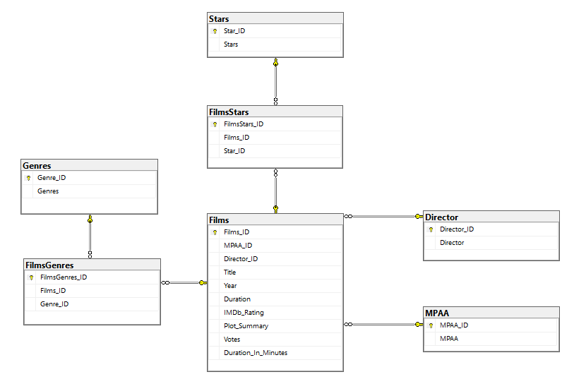
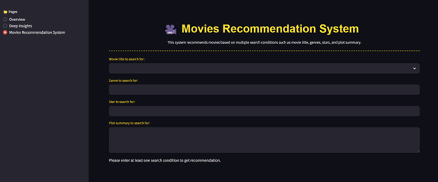
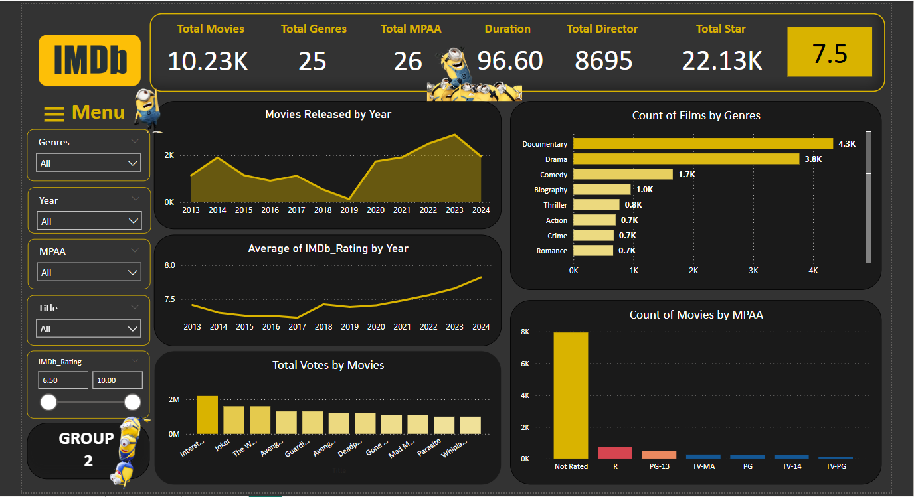
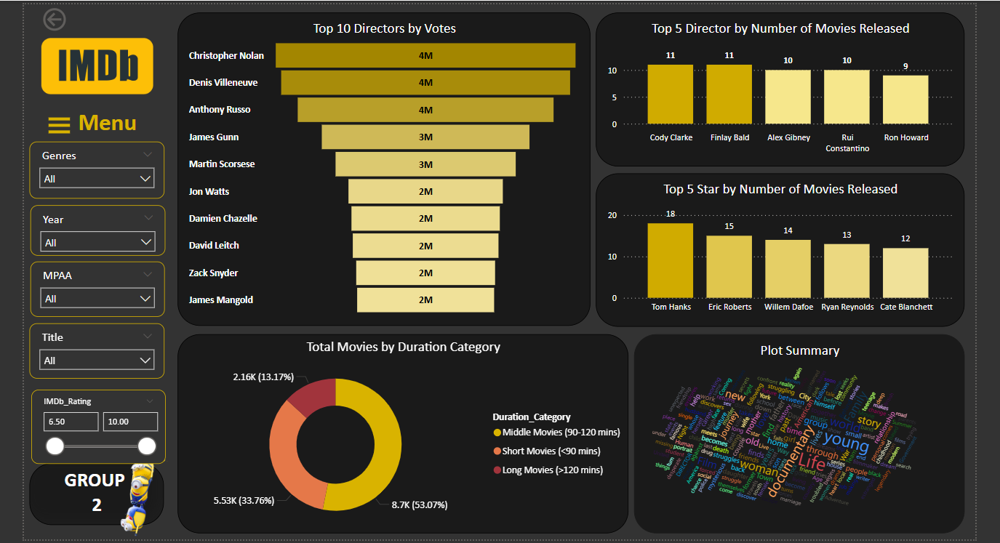
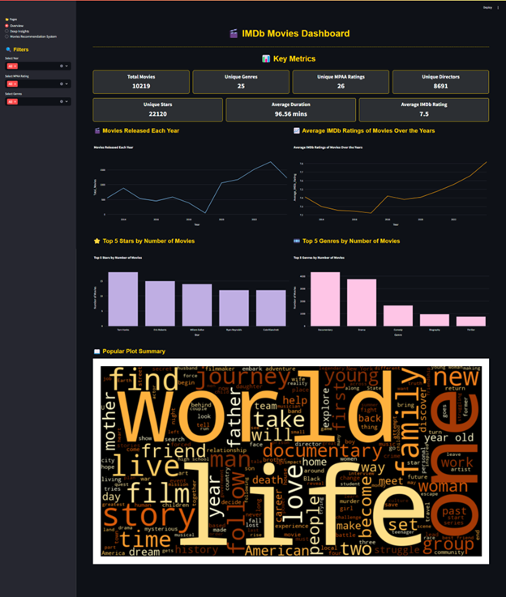
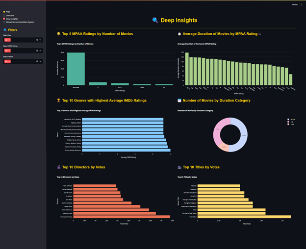

# 🎮 Content-Based Movie Recommender System

**Tagline:** An end-to-end project combining web scraping, SQL-based data engineering, BERT-enhanced NLP, and cloud deployment to build and serve intelligent movie recommendations.

---

## 📌 Project Overview

This project was developed as a comprehensive exercise for the course Database Management Systems (MIS3008\_48K29.1) at the University of Economics - University of Danang.

It aims to build a modern movie recommendation system using content-based filtering, combining classical TF-IDF techniques with semantic BERT embeddings. The project pipeline includes:

* 🤖 Crawling IMDb movie data via Selenium
* ♻ Storing and cleaning data in Google Cloud SQL Server (T-SQL)
* 📁 Normalizing data into a relational schema
* ⏳ Automating backup and recovery processes
* 🔐 Managing granular user roles and permissions
* 🎨 Building interactive dashboards using Power BI & Streamlit
* 🤖 Deploying a BERT + TF-IDF hybrid recommender system on Google Cloud Run

---

## 📊 Dataset

* **Source**: IMDb ([https://www.imdb.com](https://www.imdb.com))
* **Collection method**: Selenium web scraper
* **Fields extracted**: Title, Year, Duration, MPAA, Genres, IMDb Rating, Director, Stars, Plot Summary, Votes
* **Storage**: Google Cloud SQL Server (relational schema)

---

## 📃 Data Engineering in T-SQL (Cloud SQL)

### Schema & Cleaning

* Created raw `Movies` table
* Converted unstructured values (e.g., Duration to minutes)
* Cleaned null values in key fields
* Created derived features like genre lists, keyword summaries
* Normalized data into: `Movies`, `Genres`, `Directors`, `Stars`, `Ratings`, `Movie_Actors`, etc.

  
   
  <em>Relational Data Model (RDM)</em>

### Backup & Recovery

* Full & Differential backups via stored procedures
* Retention policy:

  * Full: 30 days
  * Differential: 2 days
* Scheduled with SQL Server Agent
* Logs captured via `fn_JobHistory`

### Security & Permissions

* Roles created:

  * `Admin`: Full control
  * `Data Engineer (DE)`: CRUD + stored procedure control
  * `Data Analyst (DA)`: Read-only
* Scripted auditing of permission status
* Centralized table `UserPermissions` for permission logging

---

## 🧰 Modeling Approach

### Feature Extraction

* `tfidf_features` built by combining title + genres + stars
* Applied TF-IDF vectorization (max 5000 terms, stopword removal)
* Encoded plot summaries using pre-trained BERT model `MiniLM-L12-v2`

### Feature Fusion & Recommendation Logic

* Combined BERT and TF-IDF vectors with equal weighting
* Calculated cosine similarity for matching movies
* Recommendation function accepts multiple conditions:

  * Title
  * Genres
  * Stars
  * Plot Summary (optional)

---

## 🖥️ Deployment Pipeline

### Google Cloud Run (Production)

* App containerized via Docker
* Deployed to Google Cloud Run with auto-scaling
* IAM roles for secure API access
* 🌐 **Live demo**: [https://imdb-cloud-1082857704507.asia-southeast1.run.app](https://imdb-cloud-1082857704507.asia-southeast1.run.app)

### Streamlit Community Cloud (Alternative UI)

* GitHub-integrated
* Lightweight demo on Streamlit.io
* 🌐 **Live demo**: [https://imdb-movies-dashboard-recommender.streamlit.app](https://imdb-movies-dashboard-recommender.streamlit.app)

  
   
  <em>Unified Recommender Web App (Google Cloud Run & Streamlit)</em>

---

## 📊 Visual Dashboard

* 📊 Power BI: Average rating by genre, actor popularity, distribution of movie durations, IMDb rating histograms
* 🎨 Streamlit + Plotly: Interactive genre filters, actor-based filtering, year slider, dynamic summaries
* 🌈 Python (Seaborn & Matplotlib): Supplementary analytics

  
   
  <em>Power BI Dashboard – Average Ratings by Genre</em>

  
   
  <em>Power BI Dashboard – Duration & Popularity Insights</em>

  
   
  <em>Streamlit Dashboard – Genre & Actor Filters</em>

  
   
  <em>Streamlit Dashboard – Year Filter & Ratings Summary</em>

---

## 📆 Project Structure (Ordered Flow)

1. **01\_Crawl\_IMDb\_Data/**

   * Selenium script to collect movie metadata from IMDb
   * Fields scraped: title, genre, duration, summary, ratings, etc.
   * Data uploaded to Cloud SQL via PyODBC

2. **02\_SQL\_Cleaning\_and\_Modeling.sql**

   * Clean nulls, fix durations, extract genres/stars
   * Normalize into multiple related tables
   * Build indexes & relationships

3. **03\_Backup\_and\_Scheduling.sql**

   * Stored procedures for full/diff backup
   * Scheduled jobs with cleanup policy
   * Logs tracked in job history function

4. **04\_SQL\_Permissions\_and\_Security.sql**

   * Setup roles (Admin, DE, DA)
   * Grant/revoke rights
   * Create `UserPermissions` table

5. **05\_PowerBI\_Dashboard/**

   * Live connected to Cloud SQL
   * Visual insights on ratings, genres, duration, actor popularity

6. **06\_Recommendation\_Model/**

   * Python notebooks for TF-IDF + BERT feature extraction
   * Cosine similarity matching function
   * Export recommendation matrix

7. **07\_Streamlit\_App/**

   * Streamlit UI for movie search and recommendation
   * Input: title, genres, actors, plot summary
   * Output: top 5 similar movies

8. **08\_Deployment/**

   * Dockerfile, requirements, and deployment scripts
   * Setup instructions for Google Cloud Run & Streamlit Cloud

---

## 🔍 Key Insights & Learnings

* IMDb lacks well-structured APIs, so scraping + parsing is essential
* Metadata is often incomplete; heavy cleaning required
* Genre & plot embeddings (via BERT) enhance matching beyond simple keyword overlap
* Role-based security + backup automation ensures cloud-readiness
* Recommendation quality improves significantly when combining semantic + keyword-based similarity

---

## 🎓 Project Team

| Member                | Roles & Contributions                               |
| --------------------- | --------------------------------------------------- |
| Pham Hoang Phuong Anh | Cloud SQL, T-SQL cleaning, schema, Google Cloud Run |
| Tieu Thanh Mai Anh    | Streamlit UI, Docker, Power BI Dashboard            |
| Nguyen Vo Thuy Hang   | Streamlit Cloud deploy, testing, Plotly dashboard   |
| Nguyen Manh Thinh     | BERT integration, vector fusion, search logic       |

**Instructor:** Dr. Hoang Nguyen Vu
**Institution:** University of Economics - University of Danang

---

## 🎉 Thank you for reading!
